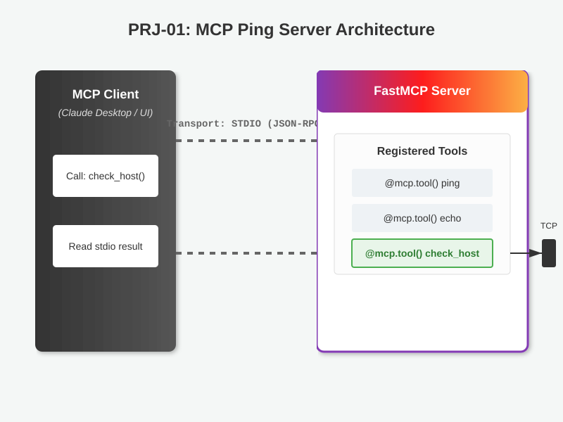

# PRJ-01 — Ping Server (MCP nível "super easy")

Servidor **MCP** (FastMCP, transporte `stdio`) — o exemplo introdutório do **Capítulo 2**
do livro *Model Context Protocol* (Sandeco), aqui com uma tool de utilidade real.

## 🏗️ Arquitetura do Servidor


## Tools

| Tool | O que faz |
|---|---|
| `ping` | Health-check do próprio servidor — retorna `pong`. |
| `echo(mensagem)` | Devolve exatamente a mensagem (teste de transporte). |
| `check_host(host, port=443, timeout=3.0)` | **Health-check TCP real**: abre conexão e mede a latência (ms). |

## Uso

```bash
uv sync
uv run python src/ping_server.py     # ou: uv run python src/main.py
```

Registre no Claude Desktop apontando para `src/ping_server.py` (transporte `stdio`).
Exemplo de uso da tool real: `check_host("1.1.1.1", 443)` → `UP 1.1.1.1:443 — 12.3 ms`.

Sem segredos externos.

## Testes

```bash
uv run pytest        # 12 testes
```

`check_host` é exercitado contra um socket TCP local em porta efêmera — nada sai da máquina.
